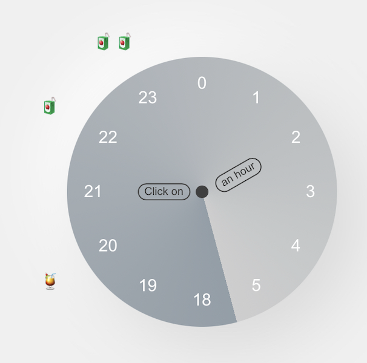
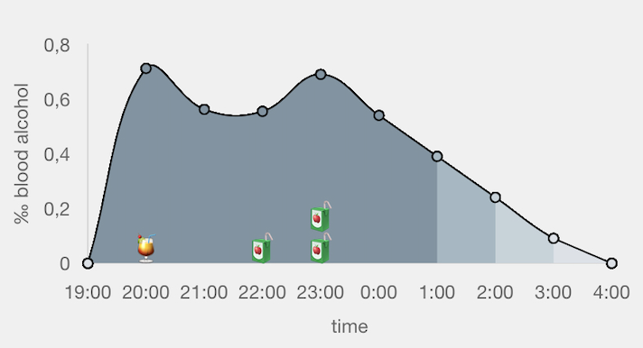

# C-alcohol
C-alcohol is a blood-alcohol-concentration calculator built for a mobile-first experience.
It is not intended to keep track of your actual alcohol level and is only for educational purposes.
The app was built since I couldn't find BAC-calculators which are easily usable on mobile devices.

The original purpose is to use the app in an educational setting: in schools, in external workshops or at home as a family. The philosophical approach behind the design is so called non-judgemental drug-prevention. The idea is that human beings, and teenagers even more, are curious beings, who want to try things out no matter the legal jurisdictions. Just because alcohol is forbidden for teenagers doesn't mean that they don't drink. In a non-judgemental drug-prevention workshop we acknowledge exactly that: It is quite likely that teenagers will try alcohol and we rather help them to make informed decisions than to pretend that just because it is prohibited, they should and would not drink alcohol.

## Try, vomit and error
A common problem is that teenagers do not know how much alcohol affects them in what way. So the only way that most humans learn about their alcohol tolerance is try, vomit and error.

By allowing users to input their data (only locally, no data is sent anywhere) and experiment with different drinks at different times, they can get an idea for how much they individually can drink.

Blood alcohol levels depend mainly on three factors:
- body size
- body weight
- gender (due to differences in body fat percentage)

### Caveats
Modern calculations include age. While this algorithm is not implemented yet, I already included the input field.
There is no data for intersex. I still found it important for teenagers who identify as inter to recognize them and include the option. Calculation-wise it uses the same numbers as females. Females tend to get drunk faster due to the allocation of body fat, and I would rather teach inter teenagers to be more cautios than to suggest to them that they can drink more.

We all know that in real-life the food you had before or while drinking is just as important, I couldn't find an algorithm that is able to include this data. Therefor I included a section about how food affects alcohol absorption rate and reccomend to simply make the teenagers aware of it.


## App structure
There are four main parts in the app:
- User info including a popup that allows to change the information about the user
- Clock, which is the clock where user can add and delete drinks.
- Chart, which is where the BAC is calculated and displayed.
- Menu, which includes functionality like switching languages, the qr-code and links to other parts of the website, which include information on how this app can be used in different educational settings.

### The clock
I chose a clock as an interface to select drinks and display them, since a drinking occasion usually stays within a 12hour-cycle. Emojis are used to differntiate different types of drinks.



### The chart
The chart displays the blood alcohol level over the course of the night. The last point on the x-axis is whenever the user would get back to 0% to showcase how long it takes to metabolize the alcohol.

Again emojis are displayed on top of the diagram to illustrate what was drunk.
Clicking on the chart gives users information about how the current BAC influences human behaviour and physiology.



### The menu
The menu allows to switch languages, which is currently only available in German and English. The Implementation is based on the Javascript internationalization API (i18n)[].


#### Adding translations
If you want to contribute to the project, you can add translations for other languages by simply adding a new file in the `src/i18n` folder and adding the translations. Copy the code from en.js and put in the translations for your language.
E.g.:
```javascript
export default {
    title: 'BAC Calculator',
    menu: {
        calculator: 'BAC Calculator',
        forTeachers: 'For Teachers & Trainers',
        about: 'About'
    },
    ...
}
```
Then create a new file in the `assets` folder and name it after your language e.g. `promill-description.es.json` and add the translations for your language. This file is used to display the information about the alcohol content on the chart - since it is linked to alcohol content, it needs its own file.

Then update the `languageManager.js` file to include your language:
```javascript
import de from './de.js';
import en from './en.js';
// add your language import here e.g. ./es.js

const translations = {
    de,
    en,
    // add your language here
};
```
Then add your language to the `index.html` file in the `language-switcher` div:
```html
<button class="flag-button" data-lang="de">🇩🇪</button>
<button class="flag-button" data-lang="en">🇬🇧</button>
<!-- add your language here -->
```


## Tech stack
I intentionally tried to keep things simple and therefor implemented this only with vanilla html, css and javascript.
Two external libraries are used via cdn:
- Chart.js for the diagram that displays the BAC
- QRcode.js for the dynamic generation of the websites URL as a QR-code to make it easier in a workshop setting to share the link.

## Running the app locally
Clone the repository:
```bash
git clone https://github.com/dasomji/alcohol-calculator.git
```

Navigate to the directory and double-click the index.html file to open it in your default browser. If you open it in your IDE, you can use a [live server](https://marketplace.visualstudio.com/items?itemName=ritwickdey.LiveServer) to run the app.


## Deployment
To deploy the app, just put it on your server or deploy on a service like vercel/Railway through auto-deploy by linking to the repository on Github/Gitlab. You do not need to set up a database since all data is stored in the browser's local storage.


## Roadmap:

- allow users to choose their own starttime of the fictional party
- update to a more modern calculation method that includes age
- add more translations
- add more country-specific drinks that change based on the language settings